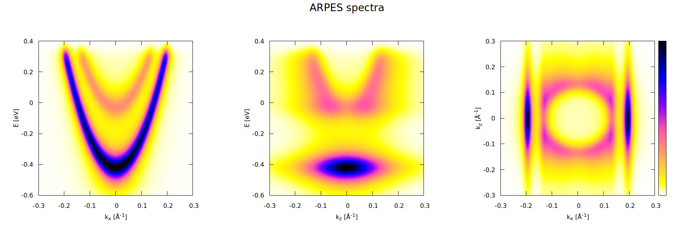

# ARPES

## Synopsis

This is a code to calculate ARPES spectra of slabs with an accumulation
or a depletion surface layer. The calculation preceeds in two steps:

1. The Poisson and the Schr&ouml;dinger equations are solved self-consistently
to obtain eigen-pairs (<code>En</code>, <code>&psi;n(z)</code>).
2. ARPES spectra are calculated using a Fourier transform of
<code>&psi;n(z)</code>, followed by a convolution with normal
distributions to account for instrumental broadening.

1D finite elements (`es_fe` library) are used to discretize the Poisson
and the Schr&ouml;dinger equations. The Intel MKL library is used to solve
linear systems, compute Fourier transforms and convolution. The
mathematical details can be found in this [PDF file](doc/model.pdf).

The results are exported into Matlab/Octave MAT-files and Gnuplot binary
matrix files.

GCC 8.3 was used to compile the code. Clang doesn't work due to an `auto`
non-type template parameter deduction bug.

## Results

Accumulation layer with one bound state:

Accumulation layer with two bound states:

Depletion layer:

## References

1. V.N.Strocov. *Photoemission response of 2D states.*
[arXiv preprint](https://arxiv.org/abs/1801.07505), 2018.
2. S.Moser at al. *How to extract the surface potential profile from
the ARPES signature of a 2DEG.*
[J. Electron. Spectrosc. **225**, 16, 2018.](https://doi.org/10.1016/j.elspec.2018.01.008)
