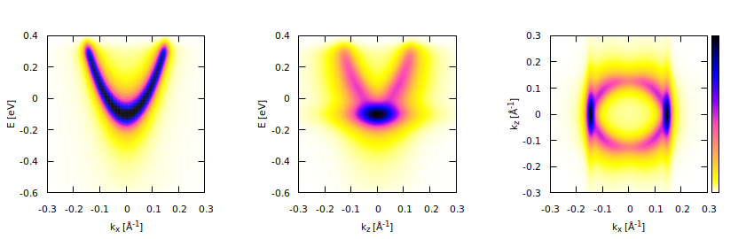
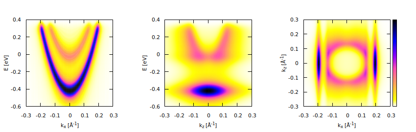

# ARPES spectra calculator

## Synopsis

This is a code to calculate ARPES spectra for slabs with an accumulation
or a depletion surface layer. The calculation proceeds in two steps:

1. The Poisson and the Schr&ouml;dinger equations are solved self-consistently
   to obtain eigen-pairs {<code>E<sub>n</sub></code>, <code>&psi;<sub>n</sub>(z)</code>}.
2. ARPES spectra are then calculated using a Fourier transform of
   <code>&psi;<sub>n</sub>(z)</code>, followed by a convolution with normal
   distributions to account for instrumental broadening.

1D finite elements ([`esf` library](https://github.com/eugnsp/esf))
are used to discretize the Poisson and the Schr&ouml;dinger equations.
The Intel MKL library is used to solve linear systems, generalized eigenvalue
system, compute Fourier transforms and convolution. The mathematical details
can be found in [this PDF file](doc/model.pdf).

The results are exported into Matlab/Octave MAT-files and Gnuplot binary
matrix files.

## Results

All images below are presented for exposition only, no attempt has been
made here to fit any experimental data.

Depletion layer (no bound states):


([Large image](example/depl.png))

Accumulation layer with one bound state:



([Large image](example/accum1.png))

Accumulation layer with two bound states:



([Large image](example/accum2.png))

## How to build

Set `MKLROOT` environment variable to point to the MKL installation directory,
and be sure that your CMake version is >= 3.13. Then:

```sh
git clone --recursive https://github.com/eugnsp/surface_arpes.git
cd surface_arpes
mkdir build && cd build
cmake -DCMAKE_BUILD_TYPE=RELEASE .. && make
```

to build the tool.

C++17 compiler is required. Tested with GCC 8.3.0 and Clang 7.0.

## How to run

```sh
./arpes [file]

./arpes ../example/accum1.txt
./arpes < ../example/accum1.txt
```

where `file` is the text file with simulation parameters (see examples in
the `example` directory). The standard input is used to read parameters
if no `file` is specified.

You can run `arpes` via a shell script

```sh
echo '#!./arpes' > accum1.sh
cat ../example/accum1.txt >> accum1.sh
chmod 755 accum1.sh
./accum1.sh
```

## Output files

The following output files are produced:

* `poisson_cl.mat` and `poisson_q.mat`

  The Matlab files that contain the following variables:

    * `vertices` &ndash; mesh points <code>z<sub>i</sub></code> [nm],
    * `ec` &ndash; <code>Ec(z<sub>i</sub>)</code> at mesh points [eV],
    * `f` &ndash; the Fermi level [eV],
    * `n` &ndash; the total charge density <code>n(z<sub>i+1/2</sub>)</code>
	  at edge mid-points [eV].

  `poisson_cl.mat` corresponds to the solution obtained using the quasi-classical
  Thomas&ndash;Fermi approximation, `poisson_q.mat` corresponds to the solution
  obtained using the Schr&ouml;dinger equation. The former one is used as an
  initial guess for the Poisson&ndash;Schr&ouml;dinger iterative solver.

* `schrod.mat`

  The Matlab file that contains the solution of the Scr&ouml;dinger equation
  obtained at the last iteration:

    * `en` &ndash; the eigen-energies <code>E<sub>n</sub></code>,
    * `psi` &ndash; the eigen-functions <code>&psi;<sub>n</sub>(z<sub>i</sub>)</code>.

* `arpes.mat`

  The Matlab file that contains the calculation parameters and ARPES spectra.
  The variables are:

    * `arpes_e_kz` &ndash; the <code>(E, k<sub>z</sub>)</code> spectrum,
    * `arpes_kx_e` &ndash; the <code>(k<sub>x</sub>, E)</code> spectrum,
    * `arpes_kx_kz` &ndash; the <code>(k<sub>x</sub>, k<sub>z</sub>)</code> spectrum,
    * `e_min`, `e_max` &ndash; the energy range <code>E<sub>min</sub> &leq;
	  E &leq; E<sub>max</sub></code> [eV],
    * `kx_max` &ndash; the momentum range <code>-k<sub>x max</sub> &leq; k<sub>x</sub>
	  &leq; k<sub>x max</sub></code> [&angst;<sup>-1</sup>],
    * `kz_max` &ndash; the momentum range <code>-k<sub>z max</sub> &leq; k<sub>z</sub>
	  &leq; k<sub>z max</sub></code> [&angst;<sup>-1</sup>],
    * `mfp` &ndash; electron mean-free path <code>&lambda;</code> [nm],
	* `sigma_e_inst` &ndash; the instrumental broadening <code>&delta;<sub>A</sub>E</code>
	  [eV],
    * `sigma_kx_inst` &ndash; the instrumental broadening <code>&delta;<sub>A</sub>k</code>
	  [&angst;<sup>-1</sup>],
    * `gamma_disorder` &ndash; the disorder broadening <code>&delta;<sub>D</sub>E</code>
	  [eV].

* `arpes_e_kz.dat`, `arpes_kx_e.dat`, `arpes_kx_kz.dat`

  The binary files that contain ARPES spectra for visualization using Gnuplot,
  see shell scripts in the `plot` directory. The figures above were generated using
  the `plot/plot_all.sh` shell script.

## External dependencies

* [Intel MKL](https://software.intel.com/en-us/mkl)
* [`eslib` library](https://github.com/eugnsp/eslib)

## References

1. V.N.Strocov. *Photoemission response of 2D states.*\
	[J. Electron. Spectrosc. **229**, 100 (2018)](https://doi.org/10.1016/j.elspec.2018.09.001),
	[arXiv preprint (2018)](https://arxiv.org/abs/1801.07505).
2. S.Moser et al. *How to extract the surface potential profile
	from the ARPES signature of a 2DEG.*\
	[J. Electron. Spectrosc. **225**, 16 (2018)](https://doi.org/10.1016/j.elspec.2018.01.008).
3. A.Trellakis et al. *Iteration scheme for the solution of the
	two-dimensional Schr&ouml;dinger&ndash;Poisson equations in quantum
	structures.*\
	[J. Appl. Phys. **81**, 7880 (1997)](https://doi.org/10.1063/1.365396).

## License

This code is distributed under GNU General Public License v3.0.
